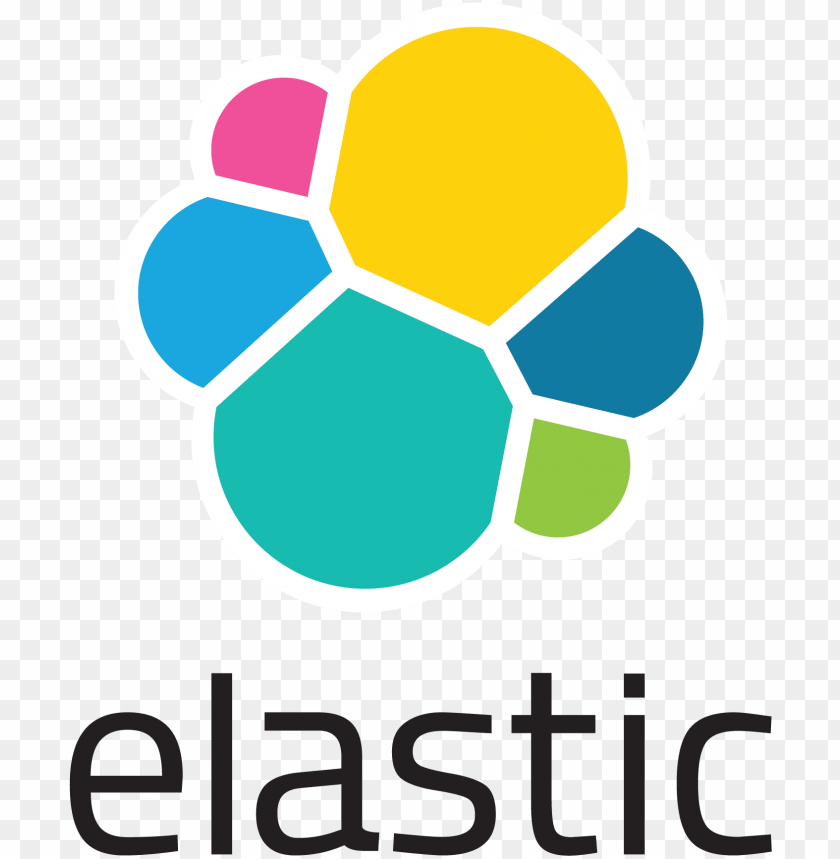

<h1 align="center">
  
</h1>

<h5 align="center">
  <code>
    <a href="https://www.linkedin.com/in/hafizur-rahman-51415120/" target="_blank" title="LinkedIn Profile"> LinkedIn</a></code>
  <code><a href="https://www.hackerrank.com/###" target="_blank" title="HackerRank Profile"> HackerRank</a></code>
  <code><a href="https://stackoverflow.com/users/###" target="_blank" title="Stack Overflow Profile"> Stack Overflow</a></code>
 
</h5>
 

  Hi, This is Md. Hafizur Rahman, Researcher & Computer Engineer & Software Developer from Bangladesh
   
   
  💻 I love writing code and learning anything about it
   
  💬 My Portfolio Website: <a href="https://hafizur.netlify.app/" title="hafizur Web">Hafizur's Site</a>
   
  📫 How to reach me: <a href="mailto: hhafizur6@gmail.com">hhafizur6@gmail.com</a> 

<h2 align="center">🔥 Languages & Frameworks & Tools & Abilities 🔥</h2>
 

  <code></code>
  <code></code>
  <code></code>
  <code></code>
  <code></code>
  <code></code>
  <code></code>
  <code></code>
  <code></code>
  <code></code>
  <code></code>
  <code></code>
  <code></code>
  <code></code>
  <code></code>
  <code></code>
  <code></code>
  <code></code>
  

<h2 align="center">⚡ Stats ⚡</h2>
 

  

    
    
    
  

           
  

    <!-- GitHub Stats - Language Card -->
    
  

   
  

  

<h2 align="center">👨‍💻 Repositories 👨‍💻</h2>
